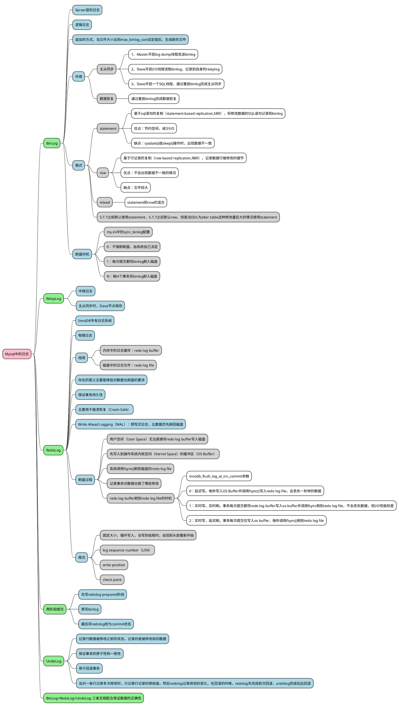

# Mysql中的日志

```plantuml
@startmindmap
<style>
mindmapDiagram {
    node {
        BackgroundColor white
    }
    :depth(0) {
      BackGroundColor #FFBBCC
    }
    :depth(1) {
      BackGroundColor lightGreen
    }
    :depth(2) {
      BackGroundColor lightBlue
    }
    :depth(3) {
      BackGroundColor lightGray
    }
}
</style>
* Mysql中的日志
** BinLog
*** Server层的日志
*** 逻辑日志
*** 追加的方式，当文件大小达到max_binlog_size设定值后，生成新的文件
*** 作用
**** 主从同步
***** 1、Master开启log dump线程发送binlog
***** 2、Slave开启I/O线程读取binlog，记录到自身的relaylog
***** 3、Slave开启一个SQL线程，通过重放binlog完成主从同步
**** 数据恢复
***** 通过重放binlog完成数据恢复
*** 格式
**** statement
***** 基于sql语句的复制（statement-based replication,SBR），将修改数据的SQL语句记录到binlog
***** 优点：节约空间，减少I/O
***** 缺点：sysdate()或sleep()操作时，出现数据不一致
**** row
***** 基于行记录的复制（row-based replication,RBR），记录数据行被修改的细节
***** 优点：不会出现数据不一致的情况
***** 缺点：文件较大
**** mixed
***** statement和row的混合
**** 5.7.7之前默认使用statement，5.7.7之后默认row，但是当DDL为alter table这种修改量巨大的情况使用statement
*** 刷盘时机
**** my.ini中的sync_binlog配置
**** 0：不强制刷盘，由系统自己决定
**** 1：每次提交都将binlog刷入磁盘
**** N：每N个事务将binlog刷入磁盘
** RelayLog
*** 中继日志
*** 主从同步时，Slave节点保存
** RedoLog
*** InnoDB专有日志系统
*** 物理日志
*** 组成
**** 内存中的日志缓存：redo log buffer
**** 磁盘中的日志文件：redo log file
*** 存在的意义主要是降低对数据也刷盘的要求
*** 保证事务持久性
*** 主要用于崩溃恢复（Crash-Safe）
*** Write Ahead Logging（WAL）：预写式日志，比数据页先刷回磁盘
*** 刷盘过程
**** 用户空间（User Space）无法直接将redo log buffer写入磁盘
**** 先写入到操作系统内核空间（Kernel Space）的缓冲区（OS Buffer）
**** 系统调用fsync()刷到磁盘的redo log file
**** 记录事务对数据也做了哪些修改
**** redo log buffer刷到redo log file的时机
***** innodb_flush_log_at_trx_commit参数
***** 0：延迟写。每秒写入OS Buffer并调用fsync()写入redo log file，会丢失一秒钟的数据
***** 1：实时写，实时刷。事务每次提交都将redo log buffer写入os buffer并调用fsync刷到redo log file，不会丢失数据，但I/O性能较差
***** 2：实时写，延迟刷。事务每次提交仅写入os buffer，每秒调用fsync()刷到redo log file
*** 格式
**** 固定大小，循环写入，当写到结尾时，会回到头部重新开始
**** log sequence number（LSN）
**** write position
**** check point
** 两阶段提交
*** 先写redolog prepared阶段
*** 再写binlog
*** 最后将redolog改为commit状态
** UndoLog
*** 记录行数据被修改之前的状态，记录的是被修改前的数据
*** 保证事务的原子性和一致性
*** 用于回滚事务
*** 当对一条行记录多次修改时，只记录行记录的原始值，然后redolog记录其他的变化，在回滚的时候，redolog先完成前次回滚，undolog完成后此回滚
** BinLog+RedoLog+UndoLog 三者互相配合保证数据的正确性
@endmindmap
```

