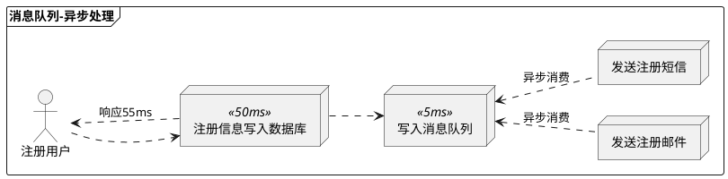
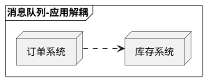
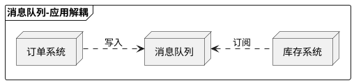
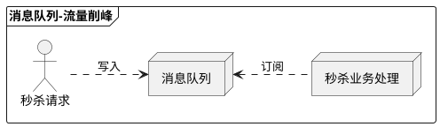
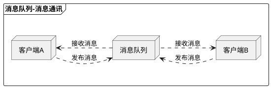
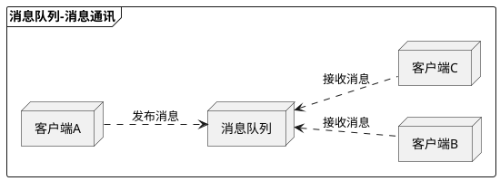
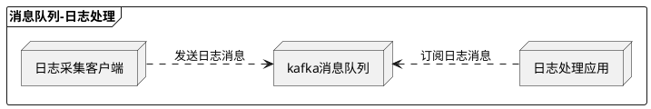
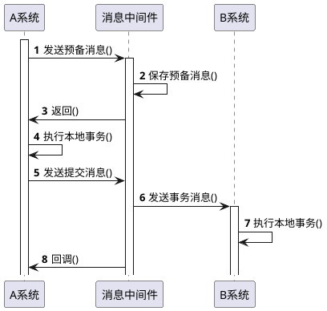
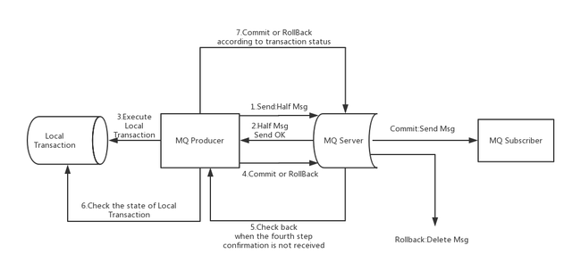

# 消息队列快速通关

## 1 概述

消息队列（Message Queue），是分布式系统中重要的组件，其通用的使用场景可以简单地描述为：

> 当不需要立即获得结果，但是并发量又需要进行控制的时候，差不多就是需要使用消息队列的时候。

消息队列主要解决了应用耦合、异步处理、流量削锋等问题。

当前使用较多的消息队列有 RabbitMQ、RocketMQ、ActiveMQ、Kafka、ZeroMQ、MetaMq 等，而部分数据库如 Redis、Mysql 也可实现消息队列的功能。

## 2 应用场景

- 异步处理
- 应用解耦
- 流量削峰
- 消息通讯
- 日志处理
- 事务消息

### 2.1 异步处理

引入消息队列，将非核心的业务逻辑，异步处理，提升响应速度。



### 2.2 应用解耦

典型的如电商系统涉及多个核心流程，从商品展示到下单、付款、发货、物流、售后等等，在微服务架构中，通常会将这些业务流程解耦成多个应用服务，服务之间的通信既可以是http或rpc协议的接口调用，如下：



也可以由消息队列来完成部分，如下：



订单系统通过消息队列与库存系统实现了解耦，订单系统生单后，无须再关系库存系统的减库存操作。

### 2.3 流量削峰

针对可能出现瞬时流量暴增的场景，比如秒杀、预定等，可以通过消息队列达到平稳过渡的效果。



用户秒杀请求直接丢入消息队列，快速响应用户请求。后续的处理由秒杀业务处理服务异步处理。

### 2.4 消息通讯

点对点通讯：



发布/订阅通讯，如社交媒体给关注的人群发：



### 2.5 日志处理

日志处理是指将消息队列用在日志处理中，比如Kafka的应用，解决大量日志传输的问题。



### 2.6 事务消息

消息事务就是基于消息队列的两阶段提交，本质上是对消息队列的一种特殊利用，它是将本地事务和发消息放在了一个分布式事务里，保证要么本地操作成功成功并且对外发消息成功，要么两者都失败。

基于消息队列的两阶段提交往往用在高并发场景下，将一个分布式事务拆成一个消息事务（A系统的本地操作+发消息）+B系统的本地操作，其中B系统的操作由消息驱动，只要消息事务成功，那么A操作一定成功，消息也一定发出来了，这时候B会收到消息去执行本地操作，如果本地操作失败，消息会重投，直到B操作成功，这样就变相地实现了A与B的分布式事务。原理如下：



#### 2.6.1 RocketMQ事务消息

RocketMQ在4.3.0版中已经支持**分布式事务消息**，这里RocketMQ采用了2PC的思想来实现了提交事务消息，同时增加一个补偿逻辑来处理二阶段超时或者失败的消息，流程如下图所示：



其具体工作流程分为**正常事务消息的发送及提交**和**不正常情况下事务消息的补偿流程**。

##### 正常流程

1. 在消息队列上开启一个`事务Topic`。
2. 事务中第一个执行的服务发送一条 `“Half Msg”`（半消息和普通消息的唯一区别是，在事务提交之前，对于消费者来说，这个消息是不可见的）给消息队列。
3. 半消息发送成功后，发送半消息的服务就会开始**执行本地事务**，根据本地事务执行结果来决定事务消息**提交或者回滚**。
4. 本地事务成功后会让这个“半消息”变成`正常消息`，供分布式事务后面的步骤执行自己的本地事务。（这里的事务消息，Producer不会因为Consumer消费失败而做回滚，采用事务消息的应用，其所追求的是`高可用`和`最终一致性`，消息消费失败的话，RocketMQ自己会负责**重推消息**，直到消费成功。）

##### 补偿流程

RocketMQ 提供**事务反查**来解决异常情况，如果 RocketMQ 没有收到提交或者回滚的请求，Broker 会定时到生产者上去反查本地事务的状态，然后根据生产者本地事务的状态来处理这个“半消息”是提交还是回滚。值得注意的是我们需要根据自己的业务逻辑来实现反查逻辑接口，然后根据返回值 Broker 决定是提交还是回滚。

## 3 消息防丢

在很多场景下消息丢失是很严重的事情，比如金融、电商场景，消息防丢需要从3个端解决。

#### 3.1 生产端防丢

- 使用事务（transaction）消息
- 开启消息确认（comfirm）机制

#### 3.2 MQ服务端防丢

- 开启持久化
- 同步刷盘

#### 3.3 消费端防丢

- 取消自动ACK
- 重试机制

## 4 消息幂等

由于网络原因，生产者可能会重复发送消息，因此消费者方必须做消息的幂等处理。

```
幂等：就是用户对于同一操作发起的一次请求或者多次请求的结果是一致的，不会因为多次点击而产生了副作用。
```

在MQ的使用场景中，可以通过生成全局唯一的**业务唯一标识**来记录该条消息是否已处理过。

## 5 消息堆积

```
消息堆积，主要是客户端本地消费过程中，由于消费耗时过长或消费并发度较小等原因，导致客户端消费能力不足，出现消息堆积的问题。
```

一般解决办法：

1. 确认消息的消费耗时是否合理
2. 查看客户端的堆栈信息，排查业务代码
3. 针对某些特殊业务场景，如果消息堆积已经影响到业务运行，且堆积的消息本身可以跳过不消费，可以通过重置消费位点跳过这些堆积的消息从最新位点开始消费，快速恢复业务。
4. 突增流量，可以增加消费端服务实例
5. 适当调大消费的并发度

## 6 消息有序

保证先后顺序的消息放到同一个队列，只用一个消费者去消费该队列。
