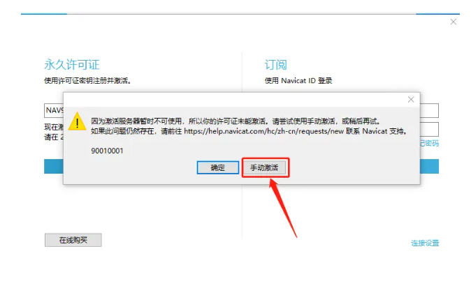
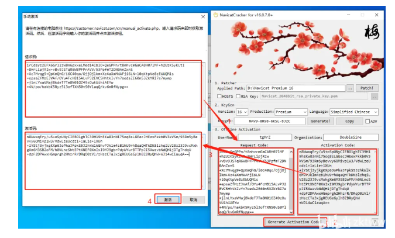
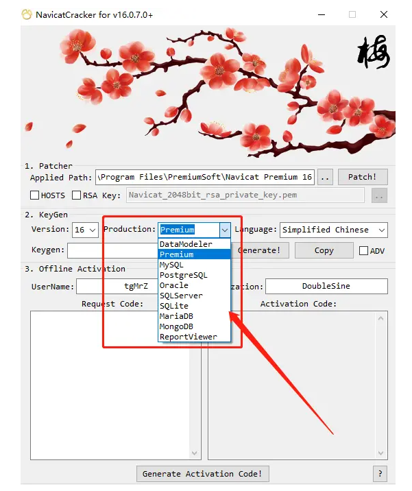

#  Navicat Premium 16激活教程

###  1.安装Navicat Premium 16 （注意版本，这里以此版本为例）；并下载激活工具
#### 1.1.Navicat Premium 下载路径：

http://www.navicat.com.cn/download/navicat-premium

#### 1.2.激活工具：

链接：https://pan.baidu.com/s/1pB5xh9CvFOnaWXWnjQX6zg?pwd=ir74
提取码：ir74

###  2.右键【以管理员身份运行】NavicatCracker.exe

### 3.选择Navicat安装目录

### 4.点击【Patch】**（点击之前不要打开Navicat）(只可Patch一次，重复操作时需重装Navicat)**

### 5.确认弹框选择【是】

### 6.打开【Navicat Premium 】软件，点击【注册】

### 7.点击【Generate】，生成激活码，复制激活码至Navicat

**（注意点击前确认【Version】与【Production】的选择应与您安装的Navicat版本一致）**

### 8.点击【手动激活】（无法出现该选项，请断网重试）

### 9.将【请求码】复制到激活软件中；点击【Generate Activation Code】；将生成的【激活码】复制到Navicat中；点击【激活】

### 10.常见问题

#### 10.1、点击 【Patch】之后,显示拒绝访问

解决方案
找到安装目录,给文件夹【PremiumSoft】开启修改权限

#### 10.2激活码错误(2022-06-24补充)

解决方案
##### 1.核对激活工具中【version】【production】选项是否和您本机安装的Navicat版本一致，默认为【16】【Premium】；上述教程在本机安装【Navicat  Premium16】环境下进行

##### 2.尝试卸载重装【Navicat Premium】，若卸载重装后任然无法成功，可能为卸载不干净导致，参考网上相关方法卸载并删除相关文件后，再次尝试；

##### 3.尝试全程断网环境下进行

#### 10.3【Patch】无响应(2022-07-14补充)

解决方案
##### 1.确认以前是否已使用激活工具激活过，尝试卸载并删除相关文件与注册表后重装Navicat

##### 2.使用相关清理脚本进行清理，尝试使用本文集中另一篇文章【Navicat Premium 16重置试用教程】中的bat文件进行清理后，再重复上述激活步骤

